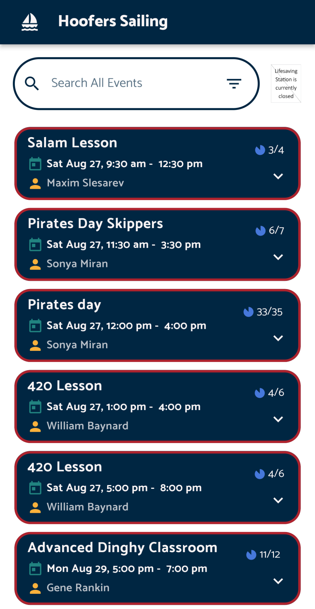
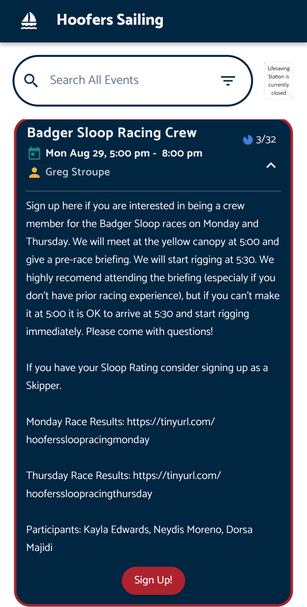
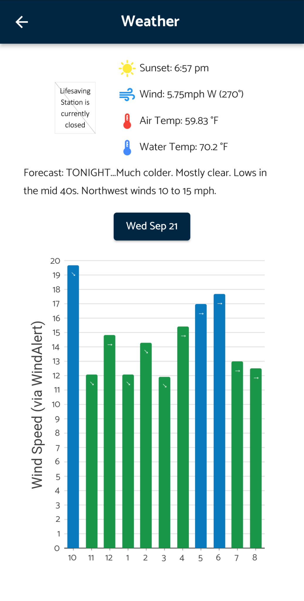
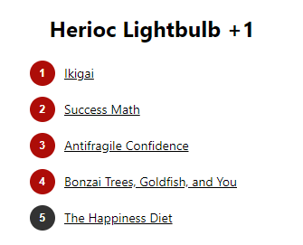
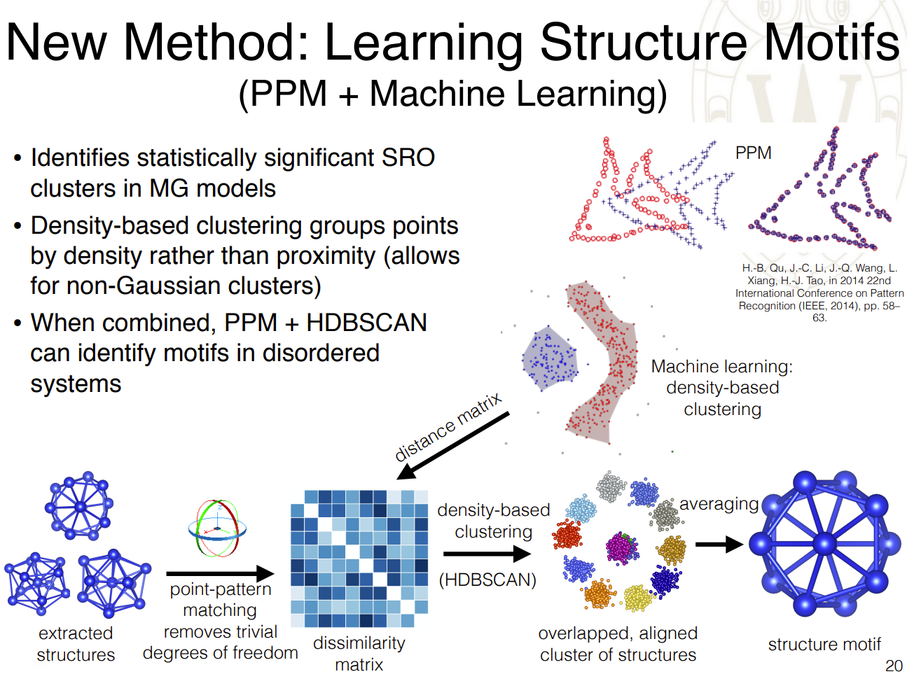
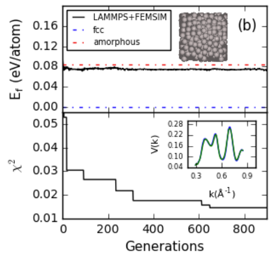

# My Projects

This is a collection of some of my more interesting personal projects. I rarely work by myself so my projects are often collaborations and are housed under various other organizations.

As a consultant, my professional work is typically covered by an NDA and is therefore not included in this project list.

## Audio Notes: a product for taking notes on podcasts

https://github.com/jjmaldonis/obsidian-audio-notes

In late-2022, I created a product that makes it easy to take notes on podcasts and other audio files. The product is implemented in the app [Obsidian](https://obsidian.md/), which is quickly gaining traction as one of the best note-taking apps on the market.

When you're listening to a podcast, how do you take notes on it? Do you scribble down the time when something interesting was said, and maybe write a sentence to jog your memory later?

No matter how much I wanted to remember something in a podcast, I rarely wrote it down and came back to it later. Until I made [Audio Notes](https://github.com/jjmaldonis/obsidian-audio-notes). The picture below is a glimpse at the end result: an audio player + a quote from the audio. The product enables an entire workflow that makes it painless to take notes on podcasts and other audio files. Check out the GitHub repo for more info.

    

## Sailing Club Mobile App

I wrote an app for our local sailing club using Flutter. It's cross-platform and is available in both the Google Play Store and Apple Store. The code is not open-source at the time of writing this, although I intend to open-source it. Below are some images of the app, which I designed myself with some input from friends.

     
     

## Heroic Lightbulb +1: A Chrome extension & recommendation algorithm

https://github.com/jjmaldonis/heroic-plus-one-recommender

[Heroic.us](heroic.us/optimize) is a fantastic collection of knowledge about living your life to the fullest. Brian Johnson, the CEO of Heroic, has created over 1,000 shorts. He calls these "+1s", and they are 1-5 minute clips with new and interesting ideas.

I wrote a recommendation algorithm that analyzes the +1s you've liked and watched, and recommends other +1s that might be up your ally. You can install a Chrome extension to get the recommendations, and every time you click it gives you a new, fun experience. The recommender will also show you a +1 that is different than why you've typically watched in the past, helping you to shake up your world and experience something new.

    

## Video Game & eSports Projects

A friend and I started Meraki Analytics, LLC in 2014 to brand our software for the video game and eSports industry. We write best-in-class software libraries to enable other developers create their dream projects. We still write software for Meraki today, and ~10,000 people have used our software.

Below are some of our open-source projects.

### Cassiopeia

https://github.com/meraki-analytics/cassiopeia

Cassiopeia (aka Cass) is a python wrapper for the Riot Games API with unparalleled features. Cass collects and manages data about the game League of Legends and is considered the best library for the Riot Games API by most of the community, along side Cass's sister library Orianna. I work on Cass and Ori with Rob Rua under the guise of Meraki Analytics, our for-fun startup company.

### LazyLists

https://github.com/meraki-analytics/merakicommons/blob/master/merakicommons/container.py#L323

A `LazyList` is a generator-backed list that lazily generates the items in the list. The lazy functionality is useful when you have a large (or expensive-to-compute) list that you may only need the first few elements of. Typically in python we use a generator to generate expensive-to-compute or high-memory elements. Generators are useful because they the compute elements on-demand and do not store the elements in memory after being iterated over. In some cases, however, we may want to reuse the elements in a generator. For example, we use `LazyList`s in Cassiopeia for paginated data; the user can access the data as if it existed in a list, and we request the data on a need-to-use basis because we recieve the data in a pages (because the incoming data is paginated).

Example usage:

    def expensive_to_compute_items():
        for i in range(0, 100):
            time.sleep(5) # each item takes 5 seconds to compute
            yield i

    my_lazy_list = LazyList(generator=expensive_to_compute_items())

    fifth_item = my_lazy_list[4]  # takes a while to compute
    first_five_items = my_lazy_list[:5]  # instantaneous

### League of Legends Champion Role Identification

https://github.com/meraki-analytics/role-identification

In the game League of Legends, five players choose champions to play on a team. These champions play different roles in the game, but those roles are flexible and depend on goals of the player in addition to the unique aspects of the champion. My Role Identification package calculates the most probable role assignments for the five champions on the team.

You can think of it like basketball players on the court. Basketball typically has a point guard, a shooting guard, a small forward, a power forward, and a center. The five champions on a team in League each play their own roles, but unlike basketball, the champions (players) can flex between different roles from game to game. My code helps users identify what champions played what role in each game, which helps with a consistent UX experience and with accurate calculations of statistics.

## Graduate Work

In grad school, I studied Materials Science & Engineering. The work is extremely interdisciplinary and included significant aspects of chemistry, physics, computer science, mathematics, and their sub-disciplines.

Below are the significant pieces of software I wrote over the years.

### Motif Extraction

https://github.com/paul-voyles/motifextraction

The motif extraction package identifies the structure of disordered atomic systems using complex machine learning clustering algorithms. I developed this code over the course of my PhD work. Paul Voyles is my thesis advisor, so this work is on his account for the sake of longevity. Using motif extraction, I was able to identify a new structure in metallic glasses that controls the physics of the system.

    

### StructOpt v2

https://github.com/uw-cmg/StructOpt/tree/master/v2-experiments-and-energy

StructOpt is a Structure Optimization suite designed for materials with complicated structure. It uses genetic algorithms to efficiently sample the massive domain space of atomic systems. StructOpt was developed in collaboration with other researchers, with myself as the main architect, during my PhD work.

    

### FEMSIM/HRMC

https://github.com/paul-voyles/femsim-hrmc

Hybrid Reverse Monte Carlo (HRMC) is a Monte Carlo structure simulation package. It uses fluctuation electron microscopy (FEM) data and energetic potentials to constrain the structure of a material, thereby generating atomic structures that are consistent with experimental FEM data and that have realistic bond lengths and geometries. I contributed to significantly this package during my PhD. Paul Voyles is my thesis advisor, so this work is on his account for the sake of longevity.

### mpi4py Examples

During my graduate work I developed some code (StructOpt, see below) that made extensive use of `mpi4py`. `mpi4py` is a Python wrapper for MPI software, which allows for communication between many nodes in a high-performance cluster. In order to test the MPI environment, I developed a few examples related to splitting the MPI communicator and spawning child processes through MPI. I put these examples on github with a bit of documentation. To my surprise, the repository has a few stars. The number of `mpi4py` users is small in comparison to the larger academic computing field, so even a few stars suggests that my examples are useful to others.
